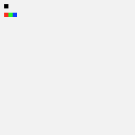
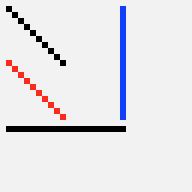
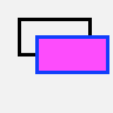
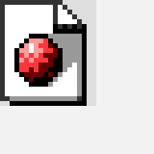
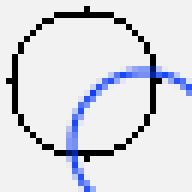

# BitmapCanvas
__Bitmap offscreen drawing in Swift for OS X__

__Description__

A clear and simple API over a CoreGraphics bitmap context.  
Loosely inspired by the ImageDraw Python library.  
Especially useful for [data visualizations](https://github.com/nst/DevTeamActivity).

__Features__

* upper-left corner based coordinates
* pixel perfect drawing of points, lines, rectangles and texts
* usable with regular CoreGraphics code
* save as PNG

__Examples__

<TABLE>

<TR>
    <TD></TD>
    <TD><PRE>// let b = Bitmap(32, 32)

let color = NSColor(deviceWhite: 0.95, alpha: 1.0)
let b = Bitmap(32, 32, backgroundColor: color)
</PRE>
    </TD>
</TR>

<TR>
    <TD></TD>
    <TD><PRE>b.point(P(1,1))

b.point(P(1,3), color: NSColor.redColor())
b.point(P(2,3), color: NSColor.greenColor())
b.point(P(3,3), color: NSColor.blueColor())</PRE>
    </TD>
</TR>

<TR>
    <TD></TD>
    <TD><PRE>b.line(P(1,1), P(10,10))
        
b.line(P(1,10), P(10,19), color: NSColor.redColor())
b.lineHorizontal(P(1,21), width: 20)
b.lineVertical(P(20, 1), height: 19, color: NSColor.blueColor())</PRE>
    </TD>
</TR>

<TR>
    <TD></TD>
    <TD><PRE>b.rectangle(R(5,5,20,10))

b.rectangle(R(10,10,20,10), strokeColor: NSColor.blueColor(), fillColor: NSColor.magentaColor())</PRE>
    </TD>
</TR>

<TR>
    <TD></TD>
    <TD><PRE>b.text("hello", P(10,10))
    
b.text("hello", P(40,30),
    rotationDegrees: -90,
    font: NSFont(name: "Helvetica", size: 10)!,
    color: NSColor.redColor())</PRE>
    </TD>
</TR>

<TR>
    <TD></TD>
    <TD><PRE>b.image(fromPath:"/usr/share/httpd/icons/sphere2.png", P(0,0))</PRE>
    </TD>
</TR>

<TR>
    <TD></TD>
    <TD><PRE>CGContextAddEllipseInRect(b.cgContext, R(2, 2, 24, 24))
CGContextStrokePath(b.cgContext)

b.setAllowsAntialiasing(true)

CGContextSetStrokeColorWithColor(b.cgContext, NSColor.blueColor().CGColor)
CGContextAddEllipseInRect(b.cgContext, R(12, 12, 24, 24))
CGContextStrokePath(b.cgContext)</PRE>
    </TD>
</TR>

<TR>
    <TD></TD>
    <TD><PRE>NSColor.orangeColor().setFill()
    
let bp = NSBezierPath()
bp.moveToPoint(P(2,2))
bp.curveToPoint(P(20,14), controlPoint1: P(14,30), controlPoint2: P(15,30))
bp.curveToPoint(P(32,13), controlPoint1: P(24,14), controlPoint2: P(24,19))
bp.closePath()
bp.fill()
bp.stroke()</PRE>
    </TD>
</TR>

<TR>
    <TD></TD>
    <TD><PRE>let path = "/tmp/bitmap.png"
b.save(path)

NSWorkspace.sharedWorkspace().openFile(path)
</PRE>
    </TD>
</TR>

</TABLE>
